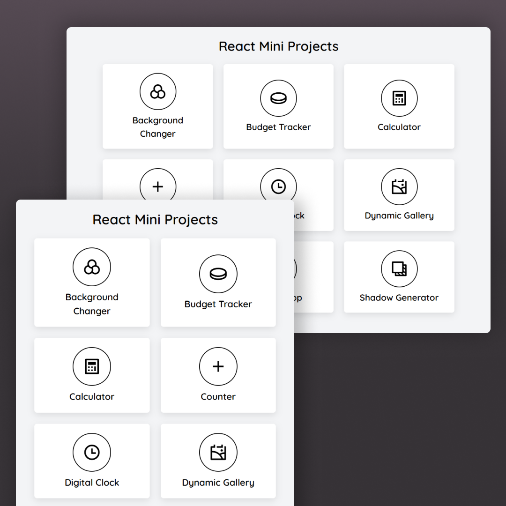

# React Mini Projects

This repository contains a collection of mini projects created with **React**, **Vite** (as the bundler), and **Tailwind CSS** for styling. The projects demonstrate the use of various React hooks and concepts, including `useState`, `useEffect`, `useContext`, `useRef`, `useCallback`, `React Router`, `localStorage`, and API fetching.

## Features

- **React Router**: Used for managing navigation across the app.
- **Tailwind CSS**: Applied for styling and responsive design.
- **Context API**: Used for managing global state in some projects.
- **LocalStorage**: Used for storing data on the client side.
- **useState, useEffect**: State management and side effects handling.
- **useRef**: Used for accessing DOM elements directly.
- **useCallback**: Used to memoize callback functions.
- **API Fetching**: Making HTTP requests to fetch data from external APIs.

## Project Showcase

| #   | Project Name                                                                                                        | Demo Link                                                                  |
| --- | ------------------------------------------------------------------------------------------------------------------- | -------------------------------------------------------------------------- |
| 001 | [Background Changer](https://github.com/Sahimbehlim/React-Mini-Projects/tree/main/src/Components/BgChanger)         | [Live Demo](https://react-mini-projects-sb.netlify.app/background-changer) |
| 002 | [Budget Tracker](https://github.com/Sahimbehlim/React-Mini-Projects/tree/main/src/Components/BudgetTracker)         | [Live Demo](https://react-mini-projects-sb.netlify.app/budget-tracker)     |
| 003 | [Calculator](https://github.com/Sahimbehlim/React-Mini-Projects/tree/main/src/Components/Calculator)                | [Live Demo](https://react-mini-projects-sb.netlify.app/calculator)         |
| 004 | [Counter](https://github.com/Sahimbehlim/React-Mini-Projects/tree/main/src/Components/Counter)                      | [Live Demo](https://react-mini-projects-sb.netlify.app/counter)            |
| 005 | [Currency Converter](https://github.com/Sahimbehlim/React-Mini-Projects/tree/main/src/Components/CurrencyConverter) | [Live Demo](https://react-mini-projects-sb.netlify.app/currency-converter) |
| 006 | [Digital Clock](https://github.com/Sahimbehlim/React-Mini-Projects/tree/main/src/Components/DigitalClock)           | [Live Demo](https://react-mini-projects-sb.netlify.app/digital-clock)      |
| 007 | [Dynamic Gallery](https://github.com/Sahimbehlim/React-Mini-Projects/tree/main/src/Components/DynamicGallery)       | [Live Demo](https://react-mini-projects-sb.netlify.app/dynamic-gallery)    |
| 008 | [Password Generator](https://github.com/Sahimbehlim/React-Mini-Projects/tree/main/src/Components/PasswordGenerator) | [Live Demo](https://react-mini-projects-sb.netlify.app/password-generator) |
| 009 | [Recipe App](https://github.com/Sahimbehlim/React-Mini-Projects/tree/main/src/Components/Recipe)                    | [Live Demo](https://react-mini-projects-sb.netlify.app/recipe-app)         |
| 010 | [Shadow Generator](https://github.com/Sahimbehlim/React-Mini-Projects/tree/main/src/Components/ShadowGenerator)     | [Live Demo](https://react-mini-projects-sb.netlify.app/shadow-generator)   |

## Screenshot

